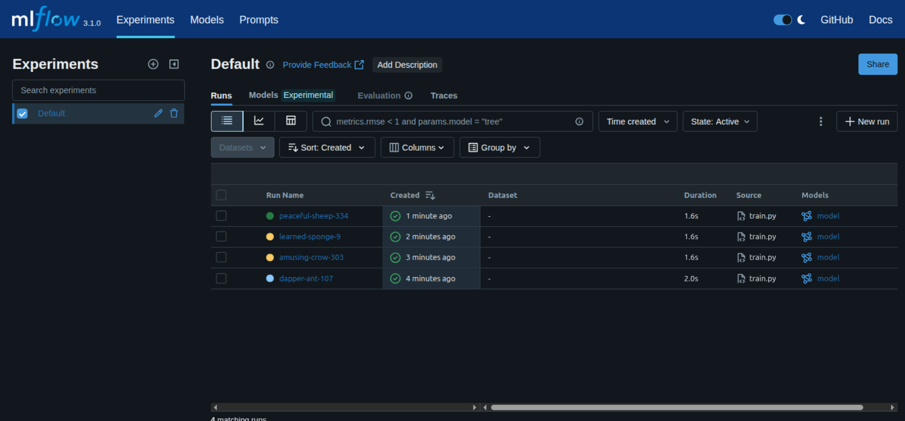

# MLflow End-to-End Pipeline (Local Setup) Iris Classifier Example

This is a simple end-to-end ML project demonstrating **MLflow** for experiment tracking, model logging, and reproducibility using the classic **Iris dataset**.


---

## 📦 Project Structure

```

mlflow\_iris/
├── train.py            # Main training script with MLflow logging
├── preprocess.py       # Data loading and train-test split
├── evaluate.py         # Optional: evaluation with saved model
├── requirements.txt    # All required dependencies
└── mlruns/             # Auto-generated by MLflow to track runs

````

---

## ⚙️ Setup Instructions

### 1. Clone the repository

```bash
git clone <repo_url>
cd mlflow_iris
````

You can change the branch for more detailed codd.

```bash
git checkout optimize
```

### 2. Install dependencies

```bash
pip install -r requirements.txt
```

---

## 🚀 Run the Training

```bash
python train.py
```

This will:

* Train a RandomForestClassifier on the Iris dataset
* Log accuracy and model to **MLflow**

---

## 📊 Launch MLflow UI

```bash
mlflow ui
```

Then open in your browser:

```
http://127.0.0.1:5000
```

You can view:

* Run parameters and metrics
* Saved models
* Artifacts (plots, etc.)

---

## 🧪 Evaluate Saved Model (Optional)

```bash
python evaluate.py
```

Update the `RUN_ID` in `evaluate.py` to load a specific logged model:

```python
model = mlflow.sklearn.load_model("runs:/<RUN_ID>/model")
```

---

## 📌 Requirements

```text
mlflow
scikit-learn
pandas
```

Install with:

```bash
pip install -r requirements.txt
```

---

## 📚 References

* [https://mlflow.org/docs/latest/index.html](https://mlflow.org/docs/latest/index.html)
* [https://scikit-learn.org/](https://scikit-learn.org/)

---

## 🧠 Author

**Dhiraj Patra** — [@your\_github](https://github.com/dhirajpatra)
